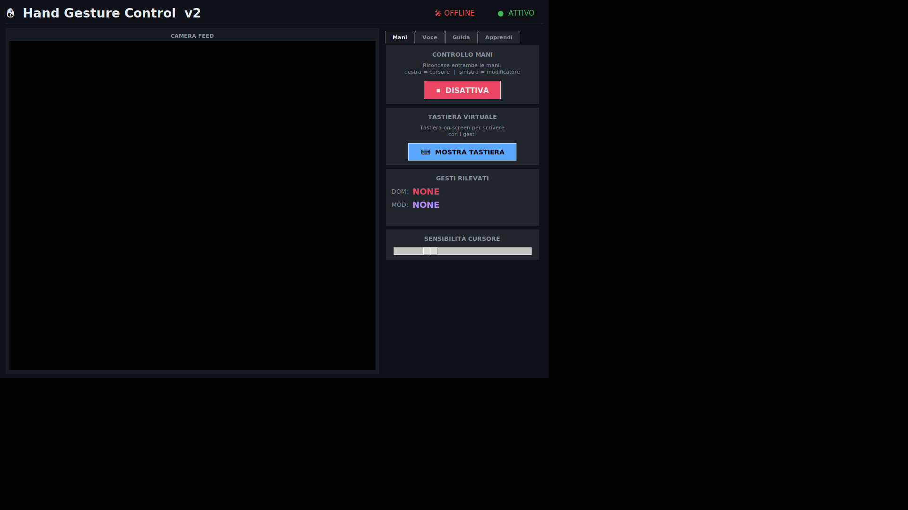
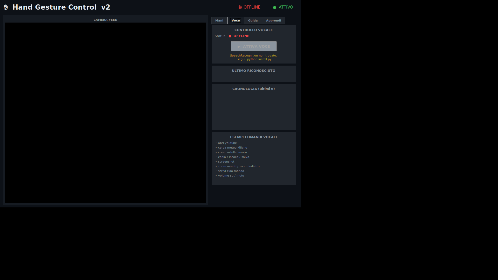
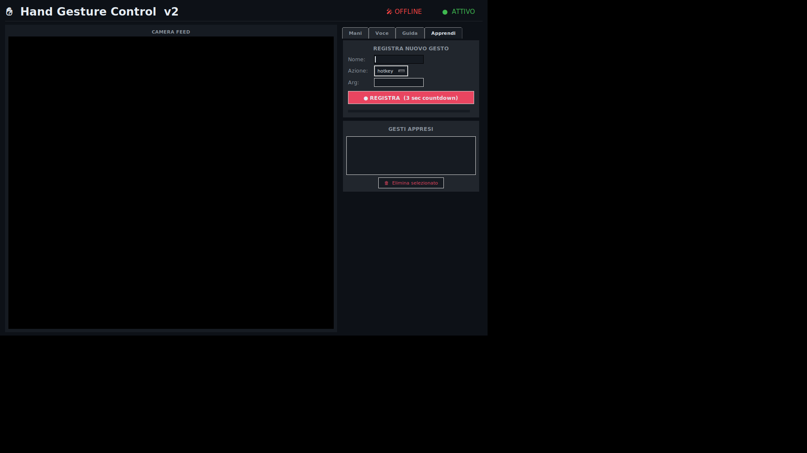

<div align="center">

# Hand Gesture Control

**Controlla il tuo PC con i gesti delle mani — nessun hardware aggiuntivo, solo la tua webcam.**

[](https://python.org)
[](https://github.com/emanueleodierna729-ship-it/hand-gesture-control)
[](test_gesture_control.py)
[](https://mediapipe.dev)
[](LICENSE)

<br/>



*Avvio immediato: il tracking è attivo di default. Nessun click necessario.*

</div>

---

## Cosa fa

Hand Gesture Control trasforma la tua webcam in un controller gestuale completo. Muovi il cursore, clicca, scrolla, esegui scorciatoie da tastiera e persino comanda l'app a voce — tutto senza toccare mouse o tastiera.

| Funzionalità | Dettaglio |
|---|---|
| **12 gesti predefiniti** | Mouse, scroll, drag, hotkey (Ctrl+C/V/Z/S, Alt+Tab…) |
| **AI adattiva (k-NN)** | Impara i tuoi gesti personalizzati dalla webcam |
| **Supporto doppia mano** | Mano dominante + mano modificatore |
| **Controllo vocale** | Comandi in italiano riconosciuti via microfono |
| **Zoom bimanuale** | Pinch con entrambe le mani = zoom in/out |
| **Stabilizzazione** | EMA + majority-vote eliminano i falsi positivi |

---

## Screenshot

<div align="center">
<table>
<tr>
<td align="center"><br/><sub>Avvio — tracking attivo</sub></td>
<td align="center"><br/><sub>Tab Voce — controllo vocale</sub></td>
<td align="center"><br/><sub>Tab Apprendi — AI personalizzata</sub></td>
</tr>
</table>
</div>

---

## Installazione rapida

```bash
# 1. Clona il repo
git clone https://github.com/emanueleodierna729-ship-it/hand-gesture-control.git
cd hand-gesture-control

# 2. Installa tutto e avvia
python install.py
```

L'installer rileva automaticamente il sistema operativo, installa le dipendenze e avvia l'app.

```bash
python install.py --only   # solo installazione, senza avviare
python hand_gesture_control.py  # avvio diretto (dopo installazione)
```

### Note per sistema operativo

| OS | Requisiti aggiuntivi |
|---|---|
| **Linux** | `sudo apt install python3-tk python3-xlib portaudio19-dev` |
| **macOS** | Preferenze → Privacy → Accessibilità → aggiungi Terminale |
| **Windows** | Avviare come Amministratore se il mouse non risponde |

---

## Gesti disponibili

### Mano dominante (destra)

| Gesto | Azione |
|---|---|
| ☝️ Solo indice | Muovi cursore |
| 🤏 Pinch pollice + indice | Click sinistro |
| 🤏 Pinch + movimento | Drag |
| 🤏 Pinch pollice + medio | Click destro |
| ✌️ Indice + medio | Scroll verticale |
| 🤌 3 dita | Copia `Ctrl+C` |
| ✋ 4 dita | Incolla `Ctrl+V` |
| 👍 Solo pollice | Doppio click |
| 🤘 Rock | Annulla `Ctrl+Z` |
| 🤙 Pollice + mignolo | Salva `Ctrl+S` |
| 🖐️ Palmo aperto veloce | Swipe ← → (`Alt+←/→`) |
| ✊ Pugno | Ferma cursore |

### Mano modificatore (sinistra)

Tieni il gesto con la mano sinistra per attivare una **modalità** che cambia il comportamento della destra:

| Gesto sinistra | Modalità | Effetto |
|---|---|---|
| 🖐️ Palmo aperto | **FREEZE** | Cursore congelato — precisione massima |
| ✊ Pugno | **ZOOM** | Scroll destra → zoom |
| ✌️ Due dita | **H-SCROLL** | Scroll orizzontale |
| 🤘 Rock | **ALT+TAB** | Scatta `Alt+Tab` |
| 👍 Pollice | **MIDDLE CLICK** | Prossimo click = tasto centrale |

### Gesto bimanuale

| Gesto | Azione |
|---|---|
| 🤏🤏 Pinch entrambe, allontanare | Zoom In |
| 🤏🤏 Pinch entrambe, avvicinare | Zoom Out |

---

## Apprendi nuovi gesti (AI)

Il tab **Apprendi** permette di insegnare all'app i tuoi gesti personalizzati:

1. Scrivi un **nome** per il gesto (es. `saluto`)
2. Scegli l'**azione** da eseguire (hotkey, apri URL, screenshot…)
3. Premi **REGISTRA** — l'app conta 3 secondi e campiona 30 frame dalla tua mano
4. Il gesto viene salvato in `user_gestures.json` e riconosciuto istantaneamente

Il classificatore usa **k-NN (K=3)** su un vettore di 20 feature (posizione dita + distanze inter-dito). Se nessun gesto personalizzato corrisponde, cade sulle 12 regole predefinite.

---

## Controllo vocale

Il tab **Voce** attiva il riconoscimento vocale in italiano. Comandi esempio:

```
"apri browser"        → apre il browser predefinito
"screenshot"          → cattura lo schermo
"volume su"           → aumenta volume
"ctrl z"              → annulla ultima azione
"chiudi finestra"     → Alt+F4
"nuova cartella"      → crea cartella sul desktop
```

Richiede `pyaudio` e una connessione internet (Google Speech Recognition). Se non disponibile, l'app continua a funzionare normalmente senza voce.

---

## Architettura

```
Webcam frame (640×480)
   │
   ▼ HandTracker (MediaPipe — max 2 mani, 21 landmark ciascuna)
   │
   ▼ LandmarkSmoother (EMA α=0.40 — elimina jitter)
   │
   ▼ GestureRecogniser (classificazione per-frame)
   │
   ▼ GestureStabiliser (majority-vote su 6 frame — elimina falsi positivi)
   │
   ▼ CustomGestureRecogniser (k-NN K=3 su gesti appresi dall'utente)
   │
   ▼ DualHandProcessor
   │   ├── _assign_roles()   — identifica mano dom/mod da posizione polso
   │   ├── _two_hands()      — zoom bimanuale
   │   ├── _update_mod()     — modalità attiva da mano modificatore
   │   └── _dominant()       — esecuzione azioni mouse/tastiera
   │
   ▼ SmoothMouse (EMA α=0.28 — cursore fluido)
```

---

## Dipendenze

| Libreria | Versione | Uso |
|---|---|---|
| `opencv-python` | ≥ 4.8 | Acquisizione e flip frame webcam |
| `mediapipe` | ≥ 0.10, < 0.10.14 | Rilevamento landmark mano |
| `pyautogui` | ≥ 0.9.54 | Controllo mouse e tastiera |
| `numpy` | ≥ 1.24 | Calcoli vettoriali |
| `Pillow` | ≥ 10.0 | Rendering frame in Tkinter |
| `pynput` | ≥ 1.7.6 | Input mouse preciso (fallback) |
| `SpeechRecognition` | ≥ 3.10 | Controllo vocale (opzionale) |
| `pyaudio` | latest | Microfono per voce (opzionale) |

> **Nota:** `mediapipe >= 0.10.14` ha rimosso l'API `mp.solutions` — l'installer fissa il vincolo automaticamente.

---

## Test

```bash
python test_gesture_control.py          # singola esecuzione (72 test)
python test_gesture_control.py --x100   # 100 run consecutive
```

```
✓ PASS  7200/7200 passed  (100.0%)  in 1.34s
```

La suite copre tutti i moduli core (parser, smoother, stabilizer, k-NN, database) ed è completamente headless — nessuna webcam né display richiesti.

---

## Struttura del progetto

```
hand-gesture-control/
├── hand_gesture_control.py   # applicazione principale (1800+ righe)
├── install.py                # auto-installer cross-platform
├── test_gesture_control.py   # test suite (72 test, headless)
├── user_gestures.json        # gesti appresi (creato a runtime)
└── README.md
```

---

<div align="center">

Fatto con ❤️ da **Emanuel Odierna** · Python + MediaPipe + Tkinter

</div>
